# Keycap Generator

You will need [OpenSCAD](https://openscad.org/) or you can use [OpenSCAD Web Playground](https://ochafik.com/openscad2). 

I used OpenSCAD nightly with [Manifold](https://github.com/elalish/manifold) support enabled so if you have any issues please try try using the same.

## Options

### Keycap

#### keycap_height
The height of the keycap. Actual height is affected by [top_roundness](#top_roundness) and/or [top_angle](#top_angle).

#### top_size
Size of the upper part of the keycap.

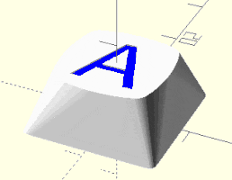 

#### top_roundness
Leave at zero to generate a flat keycap.
Values greater than zero will cause top part of the keycap to be rounded like space keycaps often are,
and negative values will create an indentation in top part of the key.

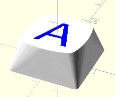 
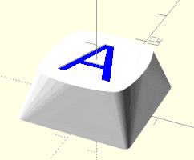 

#### top_roundness_negative_scale
Only used if [top_roundness](#top_roundness) is negative.
It scales up hidden model used to crate the indentation so that you don't have sharp edges on the top.

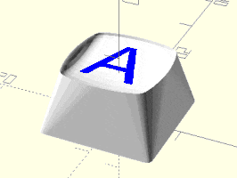 

#### top_corner_radius
Amount of keycap "roundness" for the top part.
Smaller the value gives more roundness.

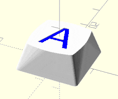 

#### top_thickness
Thickness of upper wall of the keycap.

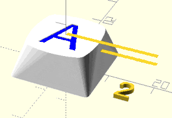 

#### top_angle
Angle ot the upper part of the keycap.

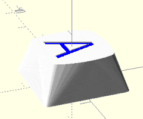

#### bottom_size
Size of the bottom part of the keycap.

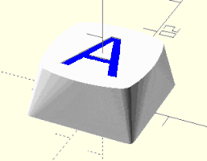

#### bottom_corner_radius
Amount of keycap "roundness" for the bottom part.
Smaller the value gives more roundness.

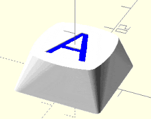

#### wall_thickness
Thickness of the keycap walls, except the top one.

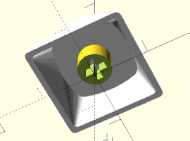

#### extrusion
Use this to create 1.25U, 1.5U, etc. keys.
It "extrudes" the middle part of the keycap to make it larger.

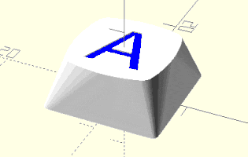

### Label

#### label_content
Letter(s)/symbol(s) you wish to have on keycap.
Can be empty.
Ignored if [label_depth](#label_depth) is zero.

#### label_depth
How deep will [label_content](#label_content) be engraved in keycap.
Ignored if [label_content](#label_content) is empty.
You will need to play around with this setting if you enable [top_roundness](#top_roundness) as it may happen that model used to create engraving will be above the keycap.

#### label_font_size
Font size of the [label_content](#label_content).

#### label_x_offset
Move [label_content](#label_content) along X axis.

#### label_y_offset
Move [label_content](#label_content) along Y axis.

#### label_font
Font used to engrave [label_content](#label_content).
In OpenSCAD you can use *Help* > *Font List* to get the overview and values you can use for this field.

#### label_font_segments
How many segments will be used to generate [label_content](#label_content).

#### label_rotation
Rotation of [label_content](#label_content).

### Stem

#### stem_offset
How much will start of the stem shaft will be offset from the keycap bottom.

#### stem_shaft_radius
Radius of the stem shaft.

#### stem_cross_width
Width of the stem cross in stem shaft.

#### stem_gutter_width
Width of cross gutters (didn't know how other to name this :P ) in stem cross.

#### stem_count
I you are generating large(r) keycaps you might want to have more than one stem shaft.

#### stem_distance
How far will individual stem shafts (centers) be distanced from one another when [stem_count](#stem_count) is larger than one.

## CLI usage

If you wish to generate a whole keycap set it might be tedious to create each one manually.
You can use [OpenSCAD CLI](https://en.wikibooks.org/wiki/OpenSCAD_User_Manual/Using_OpenSCAD_in_a_command_line_environment) to automate this process.

Basic example:
`openscad --export-format binstl -D 'label_content="Foo"' -o keycap_foo.stl keycap.scad` 

For more options take a look at linked manual page.

